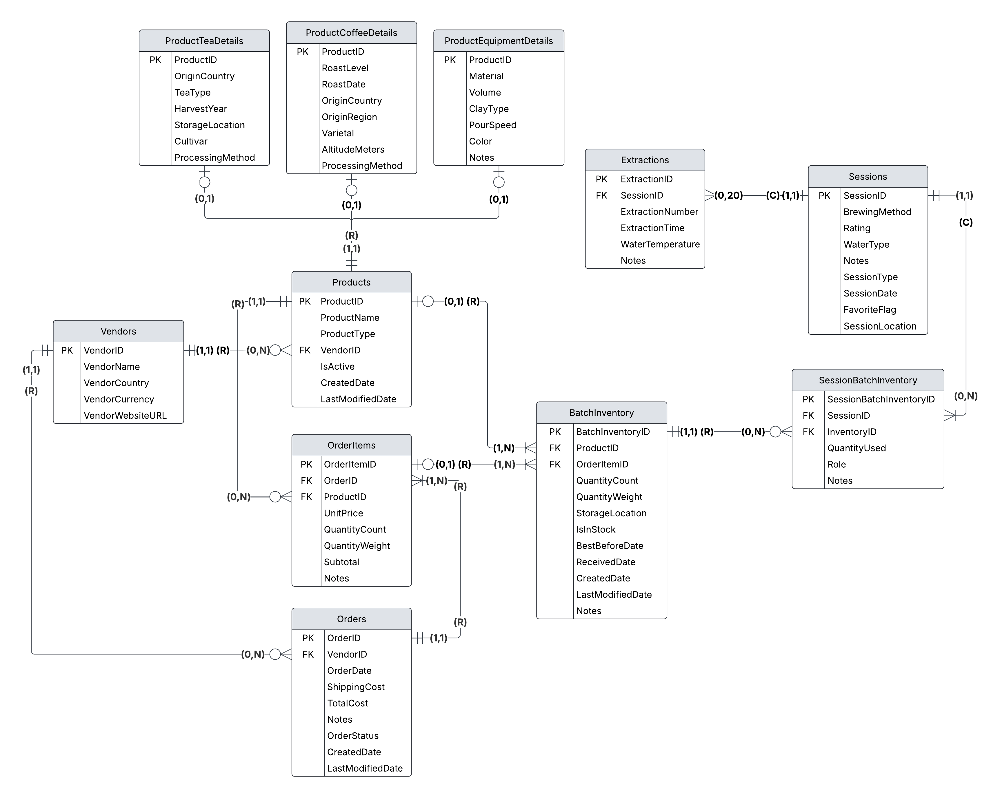
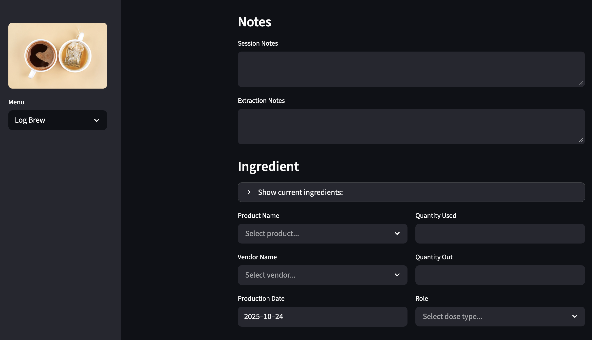
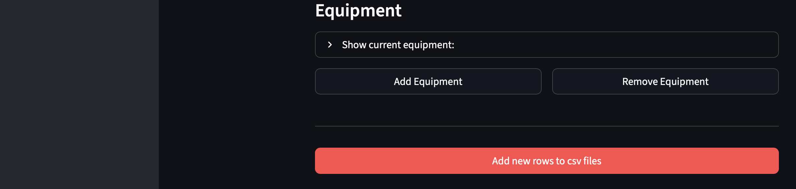
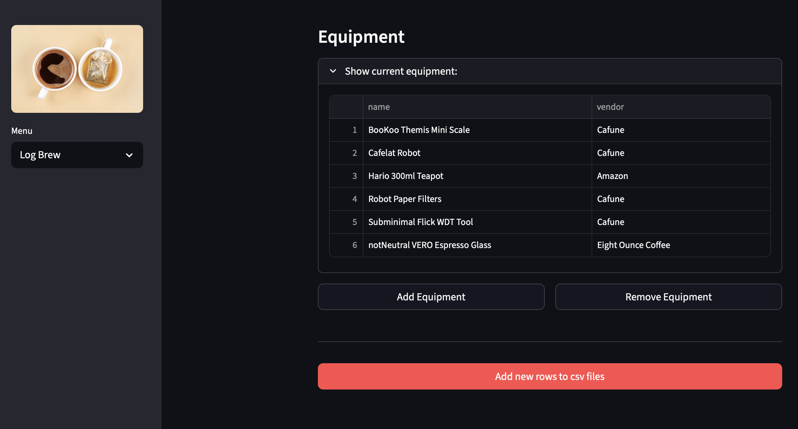
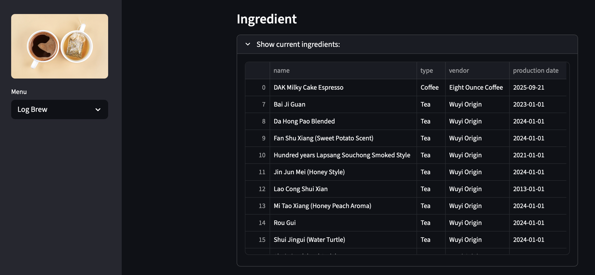

# ☕ Beverage Analytics Project  

## 📖 Overview  
This project demonstrates the full lifecycle of a modern data platform using a **beverage consumption tracker** (coffee/tea).  

- **OLTP database (Postgres)** → normalized schema for data entry
- **Data warehouse (dbt)** → star schema for analytics  
- **External data integration** → Weather API joined to consumption patterns  
- **Dashboard (Streamlit)** → UI for data entry + visualizations  
- **Productionization** → CI, orchestration (Airflow/Prefect), monitoring  
- **Cloud migration** → transition from Postgres to Snowflake/BigQuery  

This serves as my capstone portfolio project to transition from **Data Analyst → Analytics Engineer → Data Engineer → Data Architect**.  

---

## 🏗️ Architecture  
Architecture Diagram (png here once complete) 

- **Source:** Beverage entries (manual via Streamlit UI) + external weather API  
- **Storage:** Postgres OLTP  
- **Transform:** dbt (staging → marts → star schema)  
- **Analytics:** Fact + dimension model (Kimball-style)  
- **Visualization:** Streamlit dashboard  
- **Production:** Containerized (Docker), orchestrated with Prefect/Airflow, CI + monitoring  
- **Cloud:** Migration path to Snowflake/BigQuery  

---

## 📊 Data Models  

- **OLTP Schema**  
  -   

- **Star Schema**  
  - Star ERD (png here once complete)
  - Fact: `fact_consumption`  
  - Dimensions: `dim_beverage`, `dim_user`, `dim_time`, `dim_weather`, `dim_location`  

---

## 🚀 Features  

- **Data Entry:** Streamlit form → inserts into OLTP Postgres  
- **Transformations:** dbt models → fact/dim tables with tests, docs, exposures  
- **External Integration:** Daily weather API ingestion → linked to consumption  
- **Dashboards:** Trends, preferences, weather correlations  
- **Pipeline Orchestration:** Airflow/Prefect DAGs automate ingestion + transformations  
- **Data Quality:** dbt tests + Great Expectations checks  
- **Monitoring:** CI runs dbt tests on every PR; pipeline logs + alerts  
- **Cloud Migration:** dbt project runs on both Postgres and Snowflake/BigQuery  

---

## 📂 Repository Structure
```
beverage-analytics-project/
├── docs/              # Diagrams, ADRs, governance notes
├── sql/               # DDL, sample queries
├── dbt/               # dbt project
├── streamlit_app/     # Streamlit UI
├── ingestion/         # API ingestion scripts
├── orchestration/     # Airflow/Prefect DAGs
├── monitoring/        # Data quality + observability
├── docker/            # Containerization configs
└── README.md
```

---

## 🧰 Tech Stack  

- **Database:** PostgreSQL, Snowflake/BigQuery (cloud)  
- **Transformation:** dbt  
- **Dashboard:** Streamlit  
- **Pipeline:** Airflow / Prefect  
- **Monitoring:** dbt tests, Great Expectations, GitHub Actions CI  
- **Infra:** Docker, Docker Compose  

---

## 📚 References  

This project was built while studying:  
- *The Data Warehouse Toolkit* (Kimball)  
- *Agile Data Warehouse Design* (Corr)  
- *Star Schema: The Complete Reference* (Adamson)  
- *Art of SQL* (Celko)  
- *SQL Antipatterns* (Viescas)  
- *SQL Performance Explained* (Winand)  
- *Art of PostgreSQL* (Laplace)  
- *Fundamentals of Data Engineering* (Housley & Kononenko)  
- *Designing Data-Intensive Applications* (Kleppmann)  
- [DE Zoomcamp](https://github.com/DataTalksClub/data-engineering-zoomcamp)  

---

## 📌 Roadmap  

- [x] OLTP schema (Postgres)  
- [x] DDL + sample data
- [ ] Data entry UI using Streamlit
- [ ] Draft star schema ERD
- [ ] Implement star schema (Postgres)
- [ ] dbt practice project  
- [ ] Implement star schema in dbt
- [ ] Dashboard using Streamlit
- [ ] Weather API integration  
- [ ] Query tuning + indexes  
- [ ] Orchestration with Prefect/Airflow  
- [ ] CI pipeline (GitHub Actions + dbt tests)  
- [ ] Monitoring + data quality framework  
- [ ] Cloud migration (Snowflake/BigQuery)  
- [ ] ADRs + governance docs  

---

## 📸 Screenshots  

### App Overview

  


### Expanding Ingredient/Equipment List
  
  

---

## 💼 Career Relevance  

This project demonstrates skills for:  
- **Analytics Engineer** → dbt modeling, star schema, testing, dashboarding  
- **Data Engineer** → pipelines, orchestration, CI/CD, monitoring, cloud warehouse  
- **Data Architect** → schema design, ADRs, governance, system architecture  


